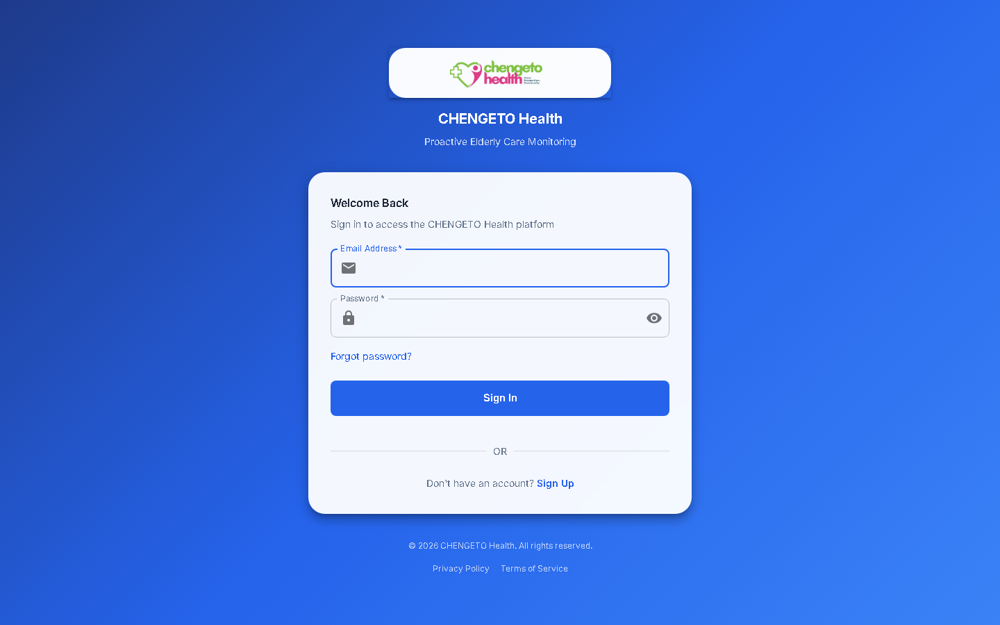
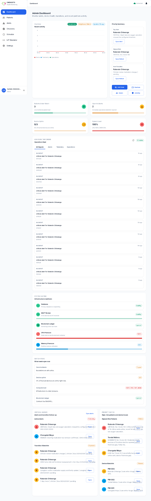
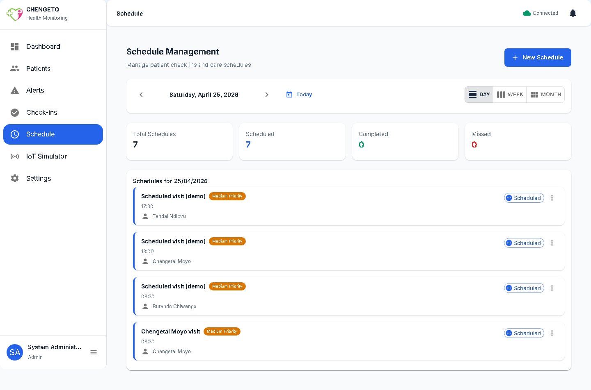
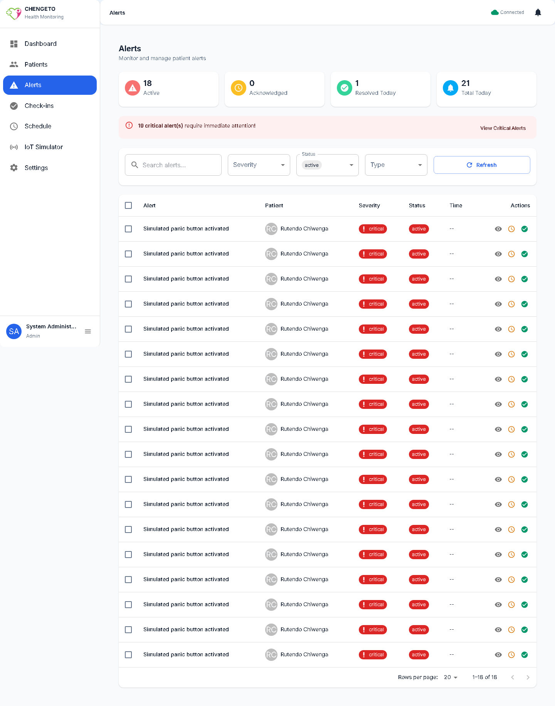
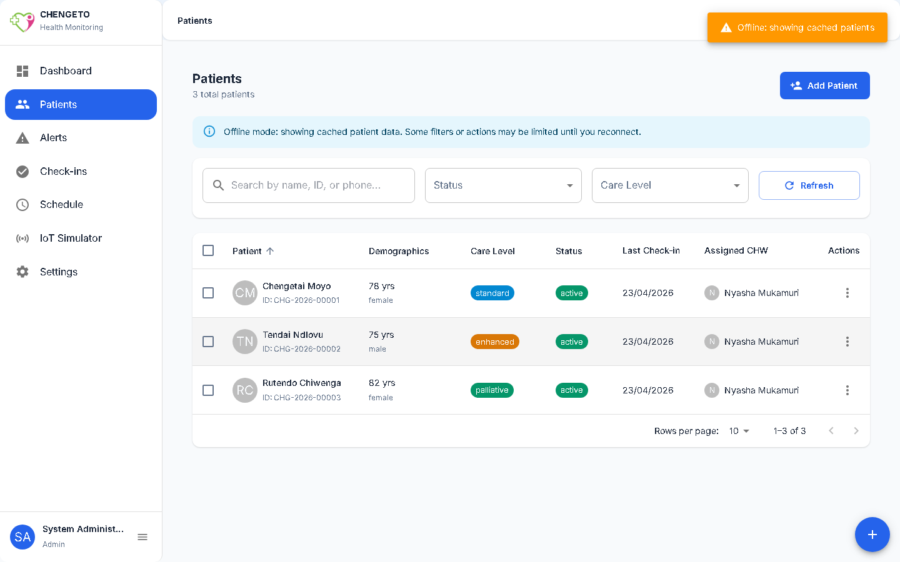
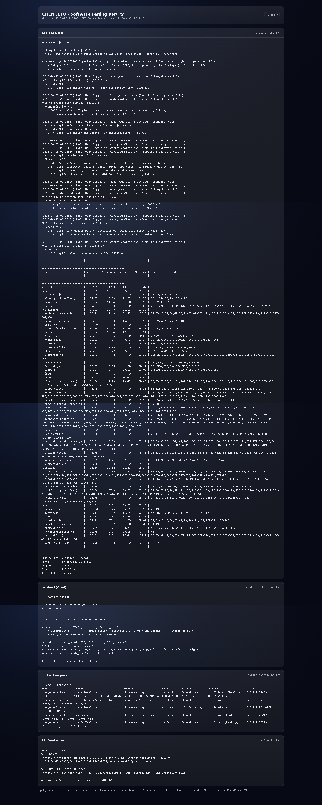

# CHENGETO Health

CHENGETO is a secure, community-centered digital health monitoring platform for proactive elderly care in rural Zimbabwe. It combines role-based workflows (caregivers, CHWs, clinicians, admins, and family members), IoT telemetry ingestion (MQTT), alert escalation, offline-first PWA behavior, and an evidence pack (screenshots + test results) for assessment.

## Highlights

- **RBAC + JWT auth** with role-specific dashboards and protected routes.
- **IoT simulator + MQTT ingestion** to demonstrate device → backend → alerts → UI end-to-end without hardware.
- **Offline-first UX** with cached views and clear “Offline: showing cached …” indicators.
- **Evidence pack for submission**: deterministic UI screenshots for all roles/routes + rendered test results with PNGs.

## Quick Start (Docker)

Run the full stack locally:

- `docker compose --profile pwa up -d --build mongodb redis blockchain backend frontend-prod`

Then open:

- Frontend: `http://127.0.0.1:80`
- API health: `http://127.0.0.1:5000/health`

If you need to (re)seed demo data:

- `docker exec chengeto-backend node scripts/seedDatabase.js`

## Demo Accounts

Seeded by `backend/scripts/seedDatabase.js`:

- Admin: `admin@chengeto.health`
- CHW: `chw1@chengeto.health`
- Caregiver: `caregiver1@example.com`
- Clinician: `clinician1@chengeto.health`
- Family: `family1@example.com`

Password:

- `Demo@123456` (or set `DEMO_PASSWORD`)

## Evidence (Screenshots + Test Results)

**Latest UI screenshots (all roles + offline + IoT proof)** are in:

- `docs/ui-snapshots/latest/`
- Index: `docs/ui-snapshots/latest/snapshot.md`

**Latest software testing outputs + screenshots** are in:

- `docs/test-results/latest/`
- HTML: `docs/test-results/latest/test-results.html`
- PNGs: `docs/test-results/latest/screenshots/`

### Key Screens (embedded)

Login:

Admin dashboard:

Schedule management (DAY view, populated for **25/04/2026**):

IoT end-to-end proof (panic alert published → alert visible):

Offline-first proof (cached data shown while offline):

Software testing results (full-page):

## Documentation

- `docs/API_DOCUMENTATION.md`
- `docs/DEPLOYMENT_GUIDE.md`
- `docs/USER_MANUAL.md`
- `docs/device-integration-spec.md`
- `docs/security-audit.md`
- `docs/monitoring-ops.md`
- `docs/ui-snapshots.md`

